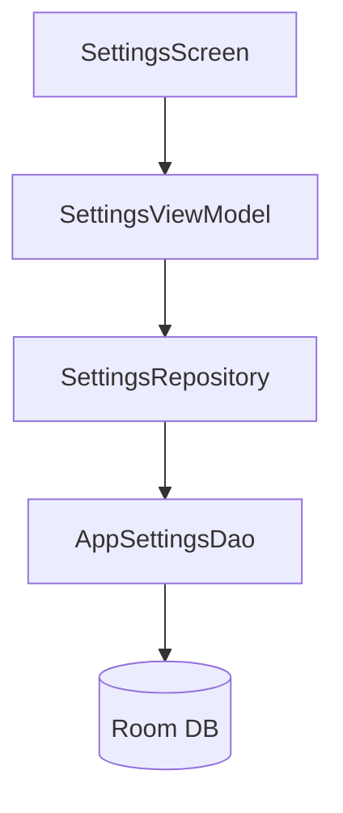

# Design Document - Issue #11: Settings Screen (Slot Times)

## Overview
The Settings Screen provides a dedicated interface for users to configure their daily measurement slots. Users can set the time for up to four slots and enable/disable slots 2, 3, and 4. The first slot is always active.

## Steering Document Alignment

### Technical Standards (tech.md)
- Follows MVVM architecture with Clean Architecture principles.
- Uses Jetpack Compose for UI and Material 3 components (TimePicker, Switch, TopAppBar).
- Manages state using `StateFlow` and `collectAsStateWithLifecycle`.
- Persists data asynchronously via Room and Kotlin Coroutines.

### Project Structure (structure.md)
- UI components: `com.example.underpressure.ui.settings`
- Persistence: `com.example.underpressure.data.local` and `com.example.underpressure.data.repository`

## Code Reuse Analysis
- **SettingsRepository**: Existing repository will be used to manage settings data.
- **AppSettingsDao**: Existing DAO will be used for Room operations.
- **Material 3 Theme**: Leveraging existing color and typography definitions.

### Integration Points
- **TopAppBar**: The main screen's `Scaffold` will be updated to include a `TopAppBar` with a settings icon.
- **Table Screen Synchronization**: Changes in settings will automatically update the column headers in `MeasurementTableScreen` via the shared `SettingsRepository`.

## Architecture

The Settings feature follows the established MVVM pattern:



### Modular Design Principles
- **SettingsViewModel**: Isolated responsibility for managing settings state and persistence logic.
- **SlotRow**: Small, focused Composable for individual slot configuration.
- **TimePickerDialog**: Reusable component for selecting slot times.

## Components and Interfaces

### SettingsScreen (Composable)
- **Purpose:** Renders the settings UI with a list of configurable slots.
- **Interfaces:** `SettingsScreen(viewModel: SettingsViewModel, onBack: () -> Unit)`
- **Dependencies:** `SettingsViewModel`

### SettingsViewModel
- **Purpose:** Manages the UI state (`SettingsUiState`) and handles persistence.
- **Interfaces:** `updateSlotTime(index: Int, time: String)`, `updateSlotActive(index: Int, isActive: Boolean)`
- **Dependencies:** `SettingsRepository`

## Data Models

### AppSettingsEntity (Updated)
```kotlin
@Entity(tableName = "app_settings")
data class AppSettingsEntity(
    @PrimaryKey val id: Int = 1,
    val masterAlarmEnabled: Boolean = false,
    val slotTimes: List<String> = listOf("07:00", "12:00", "18:00", "22:00"),
    val slotAlarmsEnabled: List<Boolean> = listOf(false, false, false, false),
    val slotActiveFlags: List<Boolean> = listOf(true, false, false, false), // NEW
)
```

### SettingsUiState
```kotlin
data class SettingsUiState(
    val slots: List<SlotConfig> = emptyList(),
    val isLoading: Boolean = false,
    val error: String? = null
)

data class SlotConfig(
    val number: Int,
    val time: String,
    val isActive: Boolean,
    val isAlarmEnabled: Boolean,
    val isToggleable: Boolean // Slot 1 is not toggleable
)
```

## Error Handling

### Error Scenarios
1. **Invalid Time Format:**
   - **Handling:** Ensure `TimePicker` returns valid 24h format strings.
   - **User Impact:** User only sees valid time selections.

2. **Database Write Failure:**
   - **Handling:** Catch exceptions in ViewModel and update `error` in `SettingsUiState`.
   - **User Impact:** Error message displayed via Snackbar or Text.

## Testing Strategy

### Unit Testing
- `SettingsViewModelTest`: Verify state updates and repository interactions.
- `SettingsRepositoryImplTest`: Ensure data is correctly saved and retrieved from the DAO.

### Integration Testing
- Verify that changes in `SettingsScreen` are reflected in `MeasurementTableScreen` column headers.

### End-to-End Testing (Manual/UI)
- Open Settings -> Change Time -> Go Back -> Observe Table Header change.
- Enable/Disable Slots -> Go Back -> Observe Table Column count change.
