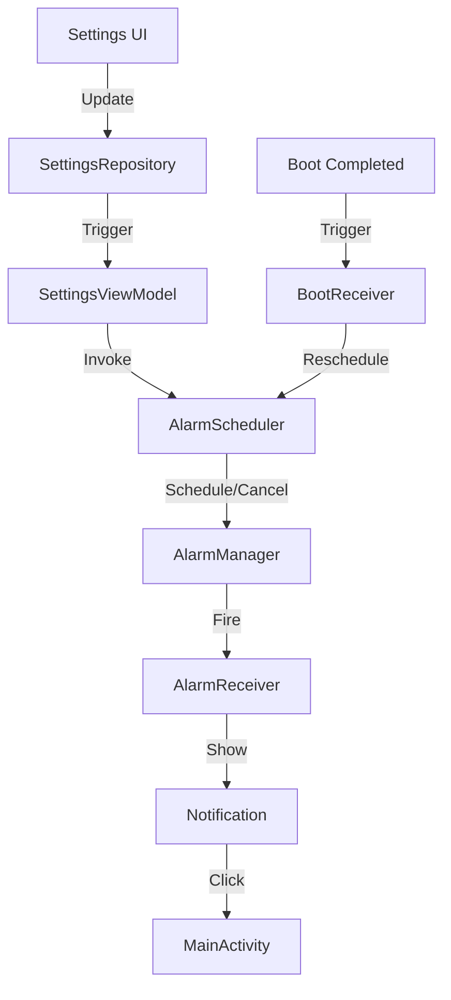

# Design Document - Issue #12: Per-Slot Alarm Implementation

## Overview
This feature implements a robust daily alarm system for blood pressure measurement slots. It uses Android's `AlarmManager` for scheduling and `NotificationManager` for user alerts. The system ensures that alarms are rescheduled on device boot and when settings change.

## Steering Document Alignment

### Technical Standards (tech.md)
- Follows standard Android patterns for background tasks (`AlarmManager`, `BroadcastReceiver`).
- Uses Kotlin Coroutines for asynchronous repository access during rescheduling.
- Adheres to Material 3 notification standards.

### Project Structure (structure.md)
- New components will be placed in `com.example.underpressure.alarm` (logic) and `com.example.underpressure.receiver` (entry points).
- UI changes will be integrated into existing `ui.settings` components.

## Code Reuse Analysis

### Existing Components to Leverage
- **SettingsRepository**: Used to retrieve current slot configurations and alarm states.
- **AppSettingsEntity**: Provides the data structure for alarm times and enabled states.
- **MainActivity**: Serving as the entry point when a user interacts with a notification.

### Integration Points
- **SettingsViewModel**: Will trigger alarm rescheduling whenever slot times or alarm states are updated.
- **Room Database**: Source of truth for alarm configurations.

## Architecture

The system follows a reactive approach to alarm management, where any change in settings or system state (like boot) triggers a reconciliation process in the `AlarmScheduler`.

## Components and Interfaces

### AlarmScheduler
- **Purpose:** Centralized logic for scheduling and canceling Android Alarms.
- **Interfaces:**
    - `updateAlarms(settings: AppSettingsEntity)`: Reconciles all slot alarms based on current settings.
    - `cancelAllAlarms()`: Stops all scheduled alarms for the application.
- **Dependencies:** `AlarmManager`, `PendingIntent`.

### AlarmReceiver (BroadcastReceiver)
- **Purpose:** Receives the alarm trigger from the system and displays the notification.
- **Interfaces:** `onReceive(context: Context, intent: Intent)`
- **Dependencies:** `NotificationManagerCompat`.

### BootReceiver (BroadcastReceiver)
- **Purpose:** Reschedules alarms after a device reboot to ensure persistence.
- **Interfaces:** `onReceive(context: Context, intent: Intent)`
- **Dependencies:** `SettingsRepository`, `AlarmScheduler`.

## Data Models
Existing `AppSettingsEntity` will be used, specifically:
- `slotTimes: List<String>`
- `slotAlarmsEnabled: List<Boolean>`
- `slotActiveFlags: List<Boolean>`

## Error Handling

### Error Scenarios
1. **Notification Permission Denied:**
   - **Handling:** Check permission before scheduling; if denied, UI should reflect that alarms might not work.
   - **User Impact:** No notification will appear if permissions are missing.
2. **Exact Alarm Permission (Android 12+):**
   - **Handling:** Use inexact alarms or check `canScheduleExactAlarms()`.
   - **User Impact:** Slight delay in alarm timing if inexact.

## Testing Strategy

### Unit Testing
- Test time calculation logic in `AlarmScheduler` (ensuring alarms are set for the future, not the past).

### Integration Testing
- Verify that saving settings triggers `AlarmScheduler` calls.
- Mock `AlarmManager` to verify correct `PendingIntent` scheduling.

### Instrumented Testing
- Use `androidx.test.uiautomator` to verify notification appearance (as requested in the ticket).
