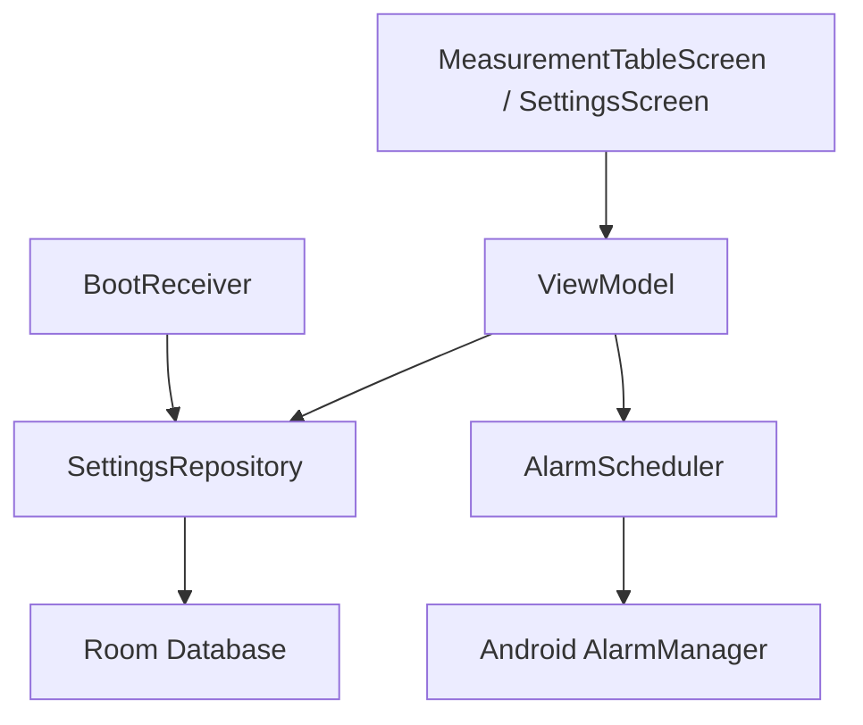

# Design Document - Global Alarm Toggle

## Overview

The Global Alarm Toggle provides a master switch to enable or disable all measurement reminders. This feature is integrated into both the Settings screen and the Main (Measurement Table) screen for quick access. It leverages the existing `masterAlarmEnabled` field in `AppSettingsEntity` to persist the state and control the `AlarmScheduler`.

## Steering Document Alignment

### Technical Standards (tech.md)
- **MVVM Pattern**: State is managed in ViewModels (`SettingsViewModel`, `MeasurementTableViewModel`) and exposed via `StateFlow` to Compose.
- **Persistence**: State is stored in the local Room database using `SettingsRepository`.
- **UI System**: Built using Jetpack Compose and Material 3 design components (TopAppBar, Switch, Icons).
- **Architecture**: Follows Clean Architecture by isolating the business logic (Alarm scheduling) from the UI layer.

### Project Structure (structure.md)
- **UI Layer**: Modifications to `SettingsScreen.kt`, `MeasurementTableScreen.kt`, and their respective ViewModels and UI States.
- **Component Separation**: A new `GlobalAlarmToggle` row will be added to `SettingsComponents.kt`.
- **Service Layer**: `AlarmScheduler` is updated to respect the master toggle.

## Code Reuse Analysis

### Existing Components to Leverage
- **SettingsRepository**: Already has `masterAlarmEnabled` support in `AppSettingsEntity`. No schema change needed.
- **AlarmScheduler**: Already handles scheduling logic; it will be extended to check the global toggle.
- **Switch Composable**: The existing custom `Switch` in `SettingsComponents.kt` will be reused for consistency.

### Integration Points
- **SettingsRepository**: The source of truth for the `masterAlarmEnabled` flag.
- **TopAppBar**: The Main screen's TopAppBar will be updated to include a new action button.
- **LazyColumn (Settings)**: A new item will be appended to the settings list with a horizontal separator.

## Architecture

The system uses a single source of truth (`AppSettingsEntity`) for the global alarm state. When the state is toggled from either the Settings or Main screen, the `SettingsRepository` updates the database, which then triggers a call to `AlarmScheduler.updateAlarms(settings)`.



## Components and Interfaces

### AlarmScheduler (Extended)
- **Purpose:** Centralized logic for scheduling and canceling alarms.
- **Interfaces:** `updateAlarms(settings: AppSettingsEntity)`
- **Updates:** Now checks `settings.masterAlarmEnabled` before scheduling any individual slot alarms. If false, it calls `cancelAlarm(slotIndex)` for all slots.

### SettingsViewModel (Updated)
- **Purpose:** Manages the state of the Settings screen.
- **Interfaces:** `updateMasterAlarmEnabled(isEnabled: Boolean)`
- **Dependencies:** `SettingsRepository`, `AlarmScheduler`
- **Updates:** Exposes `isMasterAlarmEnabled` in `SettingsUiState`.

### MeasurementTableViewModel (Updated)
- **Purpose:** Manages the state of the Main screen.
- **Interfaces:** `toggleMasterAlarm()`
- **Dependencies:** `SettingsRepository`, `AlarmScheduler`
- **Updates:** Exposes `isMasterAlarmEnabled` in `TableUiState`.

## Data Models

### SettingsUiState (Updated)
```kotlin
data class SettingsUiState(
    val slots: List<SlotConfig> = emptyList(),
    val isMasterAlarmEnabled: Boolean = false, // Added
    val isLoading: Boolean = false,
    val error: String? = null
)
```

### TableUiState (Updated)
```kotlin
data class TableUiState(
    val isLoading: Boolean = false,
    val slotHeaders: List<String> = emptyList(),
    val items: List<DayMeasurementSummary> = emptyList(),
    val dialogState: MeasurementDialogState = MeasurementDialogState(),
    val isFabEnabled: Boolean = false,
    val fabTargetSlotIndex: Int? = null,
    val isMasterAlarmEnabled: Boolean = false, // Added
    val error: String? = null,
)
```

## Error Handling

### Error Scenarios
1. **Scenario 1:** Failed to save settings to the database.
   - **Handling:** Catch exception in ViewModel, update `uiState.error`.
   - **User Impact:** Error message displayed on screen, toggle state might revert.

2. **Scenario 2:** Permission missing for exact alarms (Android 12+).
   - **Handling:** `AlarmScheduler` already uses `setAndAllowWhileIdle` if `canScheduleExactAlarms()` is false.
   - **User Impact:** None (alarms might be slightly less precise but still fire).

## Testing Strategy

### Unit Testing
- **AlarmSchedulerTest**: Verify that `updateAlarms` cancels all alarms when `masterAlarmEnabled` is false, regardless of individual slot settings.
- **ViewModel Tests**: Verify that toggling the master alarm updates the repository and triggers the scheduler.

### Integration Testing
- **Settings Integration**: Verify that changing the toggle in Settings persists correctly in `AppSettingsEntity`.
- **Boot Sequence**: Verify that `BootReceiver` correctly skips scheduling if `masterAlarmEnabled` is false after a restart.

### End-to-End Testing
- **Scenario 1:** Toggle OFF on Main screen, verify no notifications occur at scheduled times.
- **Scenario 2:** Toggle ON in Settings, verify notifications occur for active/enabled slots.
- **Scenario 3:** Change slot time while Master Toggle is OFF, verify no alarm is scheduled for the new time.
