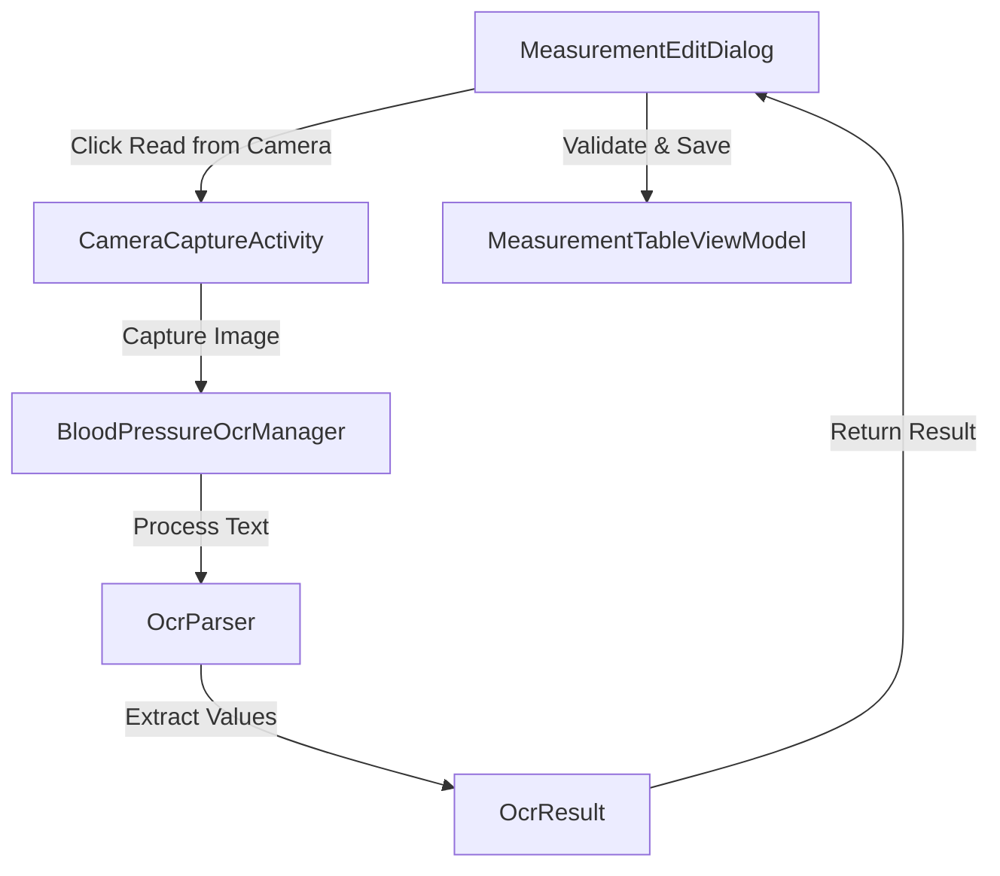

# Design Document - Camera Integration and OCR (Issue #14)

## Overview

This feature provides an automated way to input blood pressure measurements by using the device's camera and on-device Optical Character Recognition (OCR). It integrates Android CameraX for image capture and Google ML Kit for text recognition.

The user can trigger the camera from the `MeasurementEditDialog`. Once a picture is taken, the app processes the image in-memory, extracts the systolic (SYS), diastolic (DIA), and pulse values, and pre-fills the input field in the dialog.

## Steering Document Alignment

### Technical Standards (tech.md)
- **Modern Libraries**: Uses `CameraX` (Android Jetpack) and `Google ML Kit Text Recognition`.
- **Clean Architecture**: OCR logic is isolated in a dedicated package (`ocr`) and decoupled from the UI.
- **MVVM Pattern**: ViewModels manage the state of the OCR result and its integration into the measurement dialog.

### Project Structure (structure.md)
- **New Package**: `com.example.underpressure.ocr` will contain the OCR engine and parsing logic.
- **UI Package**: Camera interface will be placed in `com.example.underpressure.ui.camera`.

## Code Reuse Analysis

### Existing Components to Leverage
- **BloodPressureValidator**: Used to validate the final parsed string from the OCR result before it is saved to the database.
- **MeasurementEditDialog**: Extended with a "Read from Camera" button and logic to handle the OCR result.

### Integration Points
- **MeasurementEditDialog**: The main entry point for the user to launch the camera.
- **CameraX API**: For capturing the image without saving it to disk.
- **ML Kit Text Recognition**: For processing the in-memory bitmap/image proxy.

## Architecture

The system follows a reactive flow where the `MeasurementEditDialog` launches a `CameraActivity` (or a full-screen camera composable) which returns an OCR result.



### Modular Design Principles
- **BloodPressureOcrManager**: Responsible only for interfacing with ML Kit.
- **OcrParser**: Pure Kotlin logic for regex-based value extraction from raw strings.
- **CameraCaptureActivity**: Handles camera permissions, lifecycle, and preview.

## Components and Interfaces

### BloodPressureOcrManager
- **Purpose:** Interfaces with Google ML Kit to extract raw text from images.
- **Interfaces:** `suspend fun recognizeText(bitmap: Bitmap): String?`
- **Dependencies:** `com.google.mlkit:text-recognition`

### OcrParser
- **Purpose:** Extracts SYS, DIA, and PULSE values from raw OCR text using regex.
- **Interfaces:** `fun parse(text: String): OcrResult?`
- **Reuses:** Logic similar to `BloodPressureValidator` but more flexible to handle unstructured OCR text.

### CameraCaptureActivity
- **Purpose:** Provides the UI for capturing an image using CameraX.
- **Interfaces:** Returns a formatted string via `Intent` or shared state.
- **Dependencies:** `androidx.camera:camera-core`, `androidx.camera:camera-camera2`, `androidx.camera:camera-lifecycle`, `androidx.camera:camera-view`.

## Data Models

### OcrResult
```kotlin
data class OcrResult(
    val systolic: Int,
    val diastolic: Int,
    val pulse: Int
)
// Formatted as "SYS/DIA @PULSE"
```

## Error Handling

### Error Scenarios
1. **No Text Found:**
   - **Handling:** Show a Toast/Snackbar "No numbers detected. Please try again or enter manually."
   - **User Impact:** User returns to the dialog to try again or type.

2. **Incomplete Data (e.g., only SYS and DIA found):**
   - **Handling:** Ask the user to clarify or pre-fill only found values.
   - **User Impact:** User might need to manually add the missing pulse.

3. **Camera Permission Denied:**
   - **Handling:** Show an explanation and a button to go to Settings.
   - **User Impact:** Camera won't open.

## Testing Strategy

### Unit Testing
- **OcrParserTests**: Verify extraction from various OCR raw text outputs (noisy data, different fonts).
- **BloodPressureValidatorTests**: Ensure the OCR-generated string is valid.

### Integration Testing
- **Camera integration**: Mock ML Kit results to test the flow from Camera -> Dialog.

### End-to-End Testing
- **User scenario**: Open dialog -> click camera -> "capture" (mocked) -> see values in dialog -> click save.
