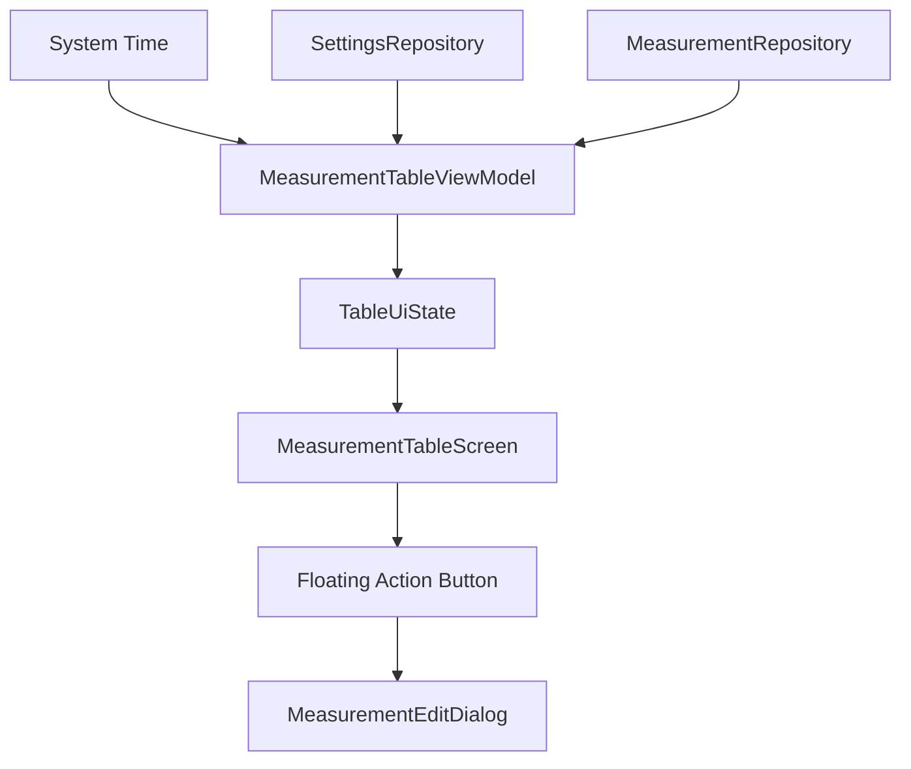

# Design Document - Issue #18: Add Measurements Action Button

## Overview
This feature adds a Floating Action Button (FAB) to the `MeasurementTableScreen`. The button's state (enabled/disabled) is dynamically calculated based on the current time and the availability of active, empty measurement slots within a +/- 15-minute window. When clicked, it opens the existing `MeasurementEditDialog` pre-filled for the identified slot.

## Steering Document Alignment

### Technical Standards (tech.md)
- **Material 3**: Uses the standard `FloatingActionButton` and `ExtendedFloatingActionButton` (if needed) from Material 3.
- **Reactive UI**: State is managed in `MeasurementTableViewModel` and exposed via `StateFlow` in `TableUiState`.
- **Lifecycle Awareness**: Uses `collectAsStateWithLifecycle` to ensure efficient state collection.

### Project Structure (structure.md)
- **UI Layer**: Changes are confined to `com.example.underpressure.ui.table` package.
- **MVVM**: Business logic for slot eligibility is handled in the ViewModel, keeping the Composable focused on rendering.

## Code Reuse Analysis

### Existing Components to Leverage
- **MeasurementEditDialog**: Reused to input measurement data.
- **TableUiState**: Extended to include FAB state.
- **MeasurementTableViewModel**: Logic for triggering the dialog is already present (`onCellClicked`), which will be leveraged by the FAB click handler.

### Integration Points
- **Scaffold**: The FAB will be integrated into the `Scaffold` component of `MeasurementTableScreen`.
- **LocalTime**: `java.time.LocalTime` will be used for time comparisons.

## Architecture
The feature follows the MVVM pattern. The ViewModel periodically or reactively calculates the current eligible slot based on the system time and the current measurements in the database.



## Components and Interfaces

### MeasurementTableViewModel
- **Purpose:** Calculates the eligibility and target slot for the FAB.
- **Logic:**
    1. Filter active slots from settings.
    2. Check if today's measurements already exist for those slots.
    3. Compare current time with slot times (±15 min window).
    4. Identify the "closest in the past" slot if multiple are within the window.
- **Interfaces:**
    - `onFabClicked()`: Triggered when the FAB is pressed.

### TableUiState
- **Purpose:** Holds the state for the FAB.
- **Properties:**
    - `isFabEnabled: Boolean`
    - `fabTargetSlotIndex: Int?`

### MeasurementTableScreen
- **Purpose:** Renders the FAB within the Scaffold.
- **Dependencies:** `MeasurementTableViewModel`.

## Data Models

### Updated TableUiState
```kotlin
data class TableUiState(
    val isLoading: Boolean = false,
    val slotHeaders: List<String> = emptyList(),
    val items: List<DayMeasurementSummary> = emptyList(),
    val dialogState: MeasurementDialogState = MeasurementDialogState(),
    val isFabEnabled: Boolean = false,
    val fabTargetSlotIndex: Int? = null,
    val error: String? = null,
)
```

## Error Handling

### Error Scenarios
1. **No Eligible Slot:**
   - **Handling:** `isFabEnabled` set to `false`.
   - **User Impact:** FAB is displayed but disabled (grayed out).

2. **Database Error:**
   - **Handling:** Standard error state in `TableUiState`.
   - **User Impact:** Error message displayed; FAB remains disabled.

## Testing Strategy

### Unit Testing
- **MeasurementTableViewModelTest**: Verify the slot selection logic with various times and slot configurations.
    - Test: FAB enabled when within 15 mins of an empty slot.
    - Test: FAB disabled when slot is already filled.
    - Test: FAB disabled when outside the 15-min window.
    - Test: Selection of "closest in past" when multiple slots overlap.

### Integration Testing
- **RepositoryIntegrationTest**: Ensure measurements saved via the FAB are correctly persisted and reflected in the table.

### End-to-End Testing (Compose UI Test)
- **MeasurementTableScreenTest**:
    - Verify FAB visibility.
    - Verify FAB enabled/disabled state based on simulated time.
    - Verify clicking FAB opens the dialog for the correct slot.
