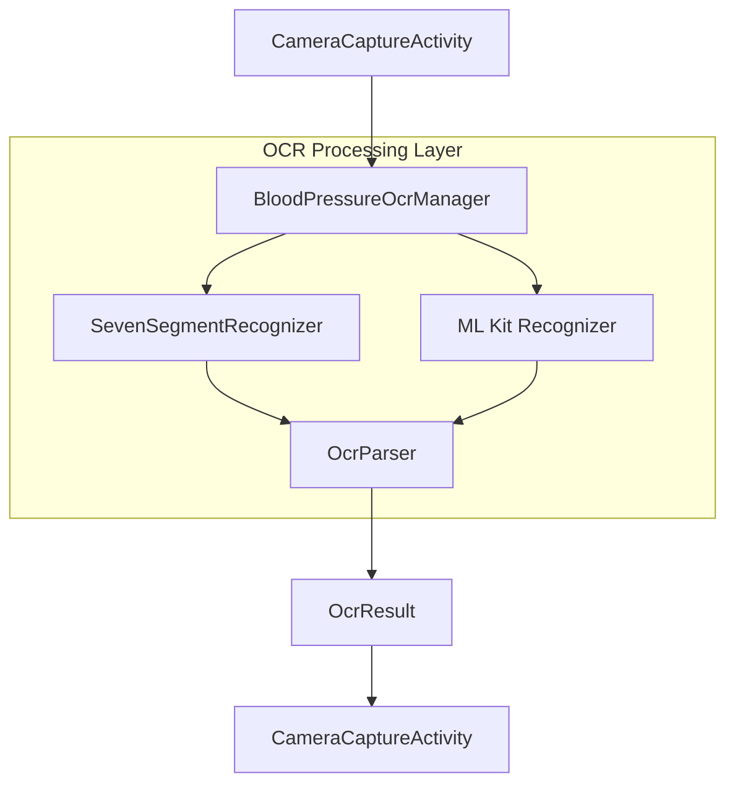

# Design Document - Issue 24: Porting Python OpenCV 7-Segment Recognition

## Overview

This design introduces a native OpenCV-based recognition pipeline specifically optimized for seven-segment digital displays. It supplements the existing ML Kit-based OCR to improve reliability for digital blood pressure monitors. The core of this feature is the `SevenSegmentRecognizer`, which ports a proven Python processing pipeline to Android.

## Steering Document Alignment

### Technical Standards (tech.md)
- **Language**: Implemented in Kotlin 2.0.
- **Dependencies**: Adds OpenCV Android SDK as a new core dependency.
- **Architecture**: Follows Clean Architecture by placing recognition logic in the OCR package, keeping it decoupled from UI.

### Project Structure (structure.md)
- **OCR Package**: All new classes will reside in `com.example.underpressure.ocr`.
- **Naming**: Follows `PascalCase` for classes (`SevenSegmentRecognizer`) and `camelCase` for methods.

## Code Reuse Analysis

### Existing Components to Leverage
- **`OcrResult`**: Used as the standard output for recognized systolic, diastolic, and pulse values.
- **`OcrParser`**: Leveraged to parse the raw numeric string returned by the OpenCV pipeline into a structured `OcrResult`.

### Integration Points
- **`BloodPressureOcrManager`**: Will be extended to orchestrate both ML Kit and the new OpenCV-based recognition.
- **`CameraCaptureActivity`**: Will utilize the updated manager to provide more robust scanning capabilities.

## Architecture

The system uses a strategy-like pattern within `BloodPressureOcrManager` to perform recognition. The OpenCV pipeline is prioritized for digital displays, with ML Kit as a fallback or parallel processor.



### Modular Design Principles
- **Single File Responsibility**: `SevenSegmentRecognizer` handles ONLY the OpenCV image processing pipeline.
- **Component Isolation**: The OpenCV SDK dependency is isolated within the OCR package.
- **Service Layer Separation**: The `BloodPressureOcrManager` acts as a service layer, hiding the complexity of underlying OCR engines.

## Components and Interfaces

### `SevenSegmentRecognizer`
- **Purpose:** Implements the 13-stage geometric recognition pipeline ported from Python.
- **Interfaces:** 
    - `recognize(bitmap: Bitmap): String?`
    - `recognize(mat: Mat): String?`
- **Dependencies:** OpenCV Android SDK.
- **Key Methods:**
    - `preprocess(src: Mat): Mat`
    - `detectDisplay(src: Mat): Mat?` (Perspective Transform)
    - `extractDigits(display: Mat): List<Mat>`
    - `classifyDigit(digit: Mat): Int`

### `BloodPressureOcrManager` (Updated)
- **Purpose:** Orchestrates multiple recognition engines.
- **Interfaces:**
    - `recognize(bitmap: Bitmap): OcrResult?`
- **Reuses:** `BloodPressureOcrManager` (existing), `OcrParser`.

## Data Models

### Internal Pipeline Models
```kotlin
// Used for internal segment mapping
private val SEGMENT_MAP = mapOf(
    listOf(1,1,1,1,1,1,0) to 0,
    listOf(0,1,1,0,0,0,0) to 1,
    // ... rest of 7-segment patterns
)
```

## Error Handling

### Error Scenarios
1. **Display Not Found:** No 4-point contour is detected in the frame.
   - **Handling:** Return null; `BloodPressureOcrManager` falls back to ML Kit or notifies the user.
   - **User Impact:** App continues to scan; user might need to adjust camera.

2. **OpenCV Init Failure:** The OpenCV library fails to load.
   - **Handling:** Log error and disable OpenCV features, falling back to ML Kit.
   - **User Impact:** Recognition might be less accurate for digital displays but app remains functional.

## Testing Strategy

### Unit Testing
- Test `SevenSegmentRecognizer` with the provided test images in `test_image/`.
- **Authoritative Test Cases:**
    - `7.jpg`: Expected output "123\n81\n92"
    - `8.jpg`: Expected output "141\n90\n85"
- Verify that each stage of the pipeline produces expected output (using intermediate `Mat` snapshots if needed).

### Integration Testing
- Verify `BloodPressureOcrManager` correctly combines `SevenSegmentRecognizer` output with `OcrParser`.
- Test the fallback mechanism between OpenCV and ML Kit.
