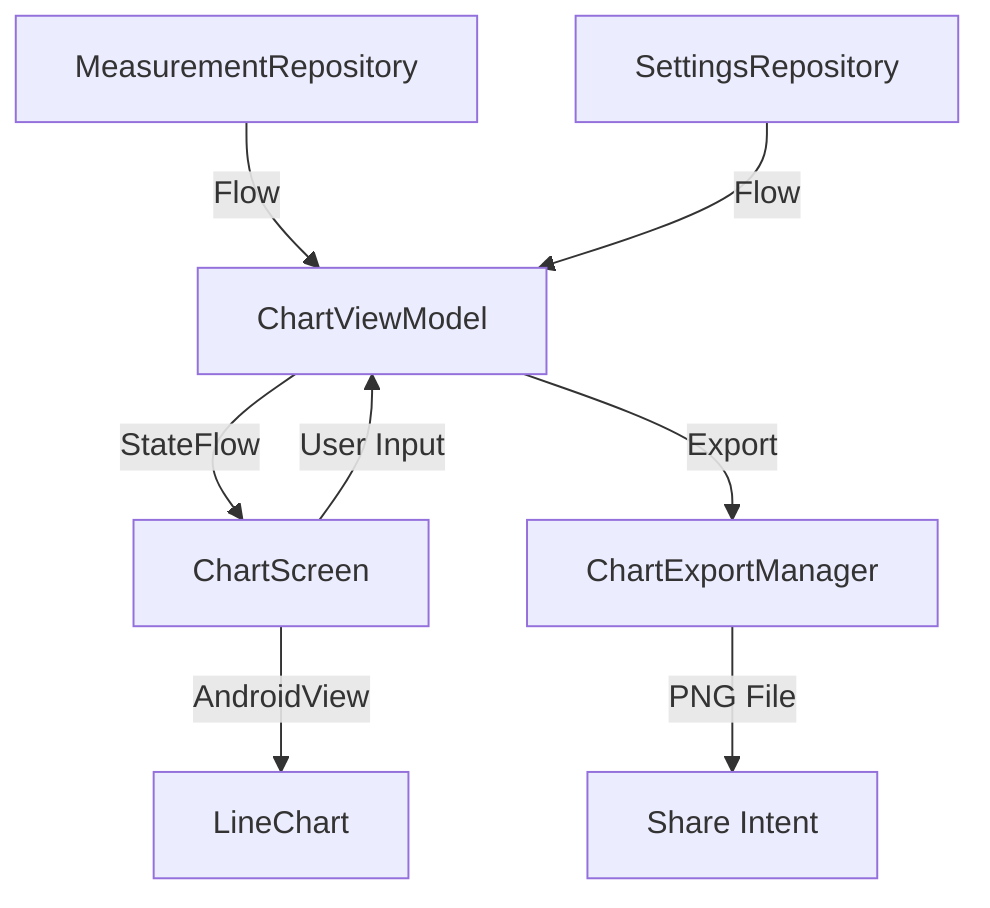

# Design Document - Issue #25: Configurable Blood Pressure Chart Activity with Sharing feature

## Overview
The Charting feature provides a visual representation of blood pressure and pulse data using `MPAndroidChart`. It allows users to filter data by slots and measurement types and share the resulting chart as a PNG image.

## Steering Document Alignment

### Technical Standards (tech.md)
- Uses **Jetpack Compose** for the UI layer.
- Follows **MVVM + Clean Architecture** patterns.
- Employs **Kotlin Coroutines** and **StateFlow** for reactive state management.
- Integrates `MPAndroidChart` via `AndroidView`.

### Project Structure (structure.md)
- UI components will be located in `com.example.underpressure.ui.chart`.
- ViewModels and UI state will follow existing naming and organization conventions.
- Export logic will be placed in `com.example.underpressure.data.export`.

## Code Reuse Analysis

### Existing Components to Leverage
- **MeasurementRepository**: Used to fetch all recorded blood pressure data.
- **SettingsRepository**: Used to retrieve active slot configurations and times.
- **FileProvider**: Reused for secure sharing of the exported PNG from the cache directory.
- **ShareViewModel**: Patterns for date range selection and error handling will be adapted.

### Integration Points
- **MeasurementEntity**: The core data model for chart points.
- **Room Database**: Source of all historical measurement data.
- **Android Cache Directory**: Destination for temporary PNG exports.

## Architecture
The feature follows a reactive data flow. The `ChartViewModel` aggregates data from repositories, applies filters, and exposes a `ChartUiState`. The `ChartScreen` observes this state and updates the `LineChart` view.



## Components and Interfaces

### ChartScreen
- **Purpose:** Primary UI container for the chart and its controls.
- **Interfaces:** `ChartScreen(viewModel: ChartViewModel)`
- **Dependencies:** `ChartViewModel`, `BloodPressureChart`, `ChartConfigurationSheet`.

### ChartViewModel
- **Purpose:** Manages the logic for data filtering, slot selection, and preparing data for `MPAndroidChart`.
- **Interfaces:** `uiState: StateFlow<ChartUiState>`, `updateConfiguration(...)`, `shareChart()`.
- **Dependencies:** `MeasurementRepository`, `SettingsRepository`, `ChartExportManager`.

### ChartExportManager
- **Purpose:** Renders a `LineChart` to a `Bitmap` and saves it as a PNG in the cache.
- **Interfaces:** `saveChartToCache(bitmap: Bitmap): File`.
- **Dependencies:** `Context`.

## Data Models

### ChartUiState
```kotlin
data class ChartUiState(
    val isLoading: Boolean = true,
    val lineData: LineData? = null,
    val selectedSlots: Set<Int> = setOf(0, 1, 2, 3),
    val selectedTypes: Set<MeasurementType> = setOf(SYS, DIA),
    val fromDate: LocalDate? = null,
    val toDate: LocalDate? = null,
    val isConfigSheetOpen: Boolean = false,
    val errorMessage: String? = null
)
```

## Error Handling

### Error Scenarios
1. **No Data Found:** No measurements exist for the selected date range.
   - **Handling:** Show a placeholder message or empty state on the chart.
   - **User Impact:** User sees "No data available for the selected period".

2. **No Slots Selected:** User deselects all slots in the configuration.
   - **Handling:** Disable the "Apply" button or show a validation error.
   - **User Impact:** User is prompted to select at least one slot.

## Testing Strategy

### Unit Testing
- `ChartViewModel`: Verify data filtering logic and state updates.
- `ChartDataProcessor`: Test the conversion from `MeasurementEntity` to `MPAndroidChart` entries.

### Integration Testing
- Test the flow from `MeasurementRepository` to `ChartViewModel` ensuring data is correctly mapped.
- Verify that `ChartExportManager` correctly interacts with the file system.
