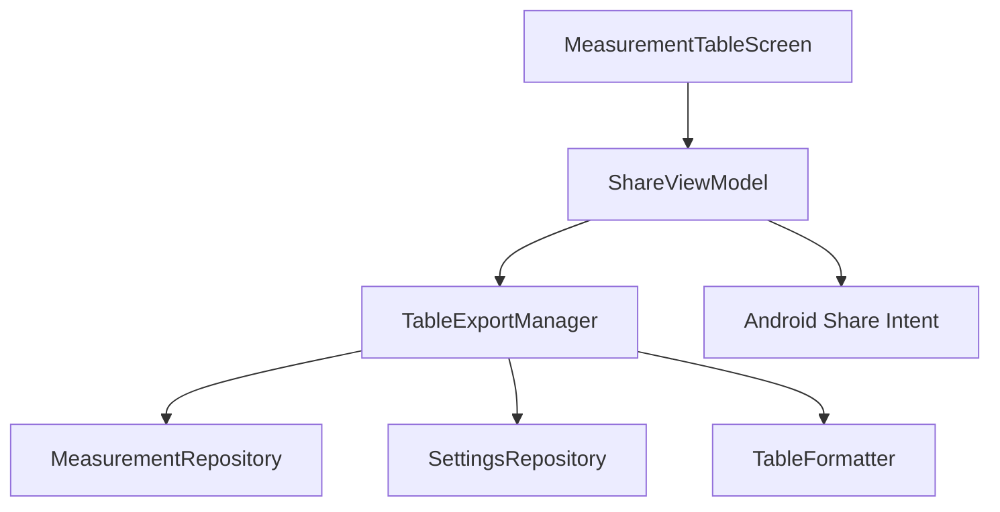

# Design Document - Issue #27: Share Table Data as ASCII Message or CSV Export

## Overview
This feature adds functionality to share and export blood pressure measurement data. Users can select a date range and choose between sharing an aligned ASCII text table (ideal for messaging) or exporting a CSV file (ideal for spreadsheet analysis).

## Steering Document Alignment

### Technical Standards (tech.md)
- **Language**: Implementation in Kotlin 2.0.
- **Asynchronous**: Use of Kotlin Coroutines for file generation and data processing to maintain UI responsiveness.
- **UI Toolkit**: Jetpack Compose and Material 3 for the Share Dialog.
- **Security**: Use of `FileProvider` for secure CSV sharing from the app's cache directory.

### Project Structure (structure.md)
- **Domain Layer**: Export logic placed in `com.example.underpressure.domain.export`.
- **Data Layer**: File persistence logic placed in `com.example.underpressure.data.export`.
- **UI Layer**: Share-related UI and ViewModel placed in `com.example.underpressure.ui.table`.

## Code Reuse Analysis

### Existing Components to Leverage
- **MeasurementRepository**: Used to fetch measurement data for the selected date range.
- **SettingsRepository**: Used to retrieve active slots and their configured times for table headers.
- **BloodPressureValidator**: Logic patterns for validation can be adapted for date range checks.

### Integration Points
- **MeasurementTableScreen**: A new share icon button will be added to the TopAppBar.
- **MainActivity**: Update the `viewModelFactory` to provide `ShareViewModel`.
- **AndroidManifest.xml**: Register a `FileProvider` for sharing CSV files.

## Architecture

The sharing feature follows the established Clean Architecture pattern, separating data retrieval, formatting logic, and UI state management.



### Modular Design Principles
- **TableExportManager**: Coordinates the retrieval and transformation of data for export.
- **TableFormatter**: Pure logic for generating ASCII and CSV strings (Single Responsibility).
- **ShareViewModel**: Manages the state of the Share Dialog and triggers intents.

## Components and Interfaces

### TableExportManager
- **Purpose**: Coordinates data collection and formatting for sharing.
- **Interfaces**:
    - `suspend fun generateAsciiTable(from: LocalDate?, to: LocalDate?): String`
    - `suspend fun generateCsvFile(from: LocalDate?, to: LocalDate?): File`
- **Dependencies**: `MeasurementRepository`, `SettingsRepository`, `TableFormatter`.

### ShareViewModel
- **Purpose**: Manages UI state for the Share Dialog (date selection, format, errors).
- **Interfaces**:
    - `fun updateDateRange(from: LocalDate?, to: LocalDate?)`
    - `fun shareAsMessage()`
    - `fun exportCsv()`
- **Dependencies**: `TableExportManager`.

### ShareDialog (Composable)
- **Purpose**: Material 3 dialog for selecting date range and export format.
- **Dependencies**: `ShareViewModel`.

## Data Models

### ShareUiState
```kotlin
data class ShareUiState(
    val isOpen: Boolean = false,
    val fromDate: LocalDate? = null,
    val toDate: LocalDate? = null,
    val dateError: String? = null,
    val isProcessing: Boolean = false
)
```

## Error Handling

### Error Scenarios
1. **Invalid Date Range:** From date is after To date.
    - **Handling:** `ShareViewModel` validates dates and sets `dateError` in `ShareUiState`.
    - **User Impact:** Share buttons are disabled, and an error message is shown.
2. **No Data for Range:** No measurements found for selected dates.
    - **Handling:** `TableExportManager` returns an empty message or throws an exception handled by the ViewModel.
    - **User Impact:** User is notified that no data exists for the selected range.
3. **File System Error:** Failure to create CSV in cache.
    - **Handling:** Caught in `TableExportManager`, propagated to UI.
    - **User Impact:** Snackbar shows "Export failed".

## Testing Strategy

### Unit Testing
- **TableFormatterTest**: Verify ASCII alignment for 1-4 columns and missing values.
- **TableFormatterTest**: Verify CSV structure and escaping.
- **ShareViewModelTest**: Verify date validation logic and state transitions.

### Integration Testing
- **ExportIntegrationTest**: Verify the end-to-end flow from Repository to formatted output.

### End-to-End Testing
- **ShareFlowTest**: Use UI Automator to verify that clicking the share button opens the Android Share Sheet.
