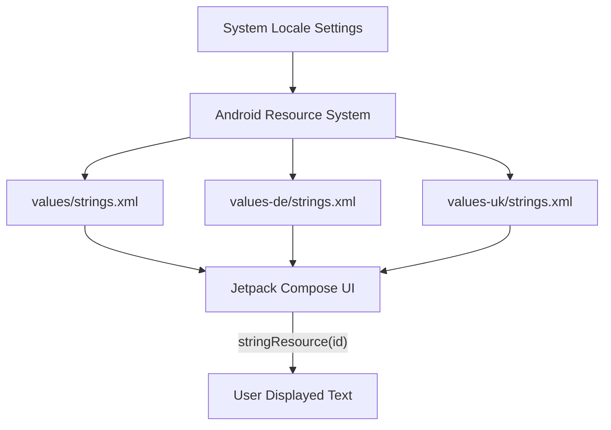

# Design Document - Localization Setup

## Overview
This feature implements a localization framework to support multiple languages in the UnderPressure application. It involves centralizing all user-facing strings into `strings.xml` and providing translations in `values-de/strings.xml` (German) and `values-uk/strings.xml` (Ukrainian). This ensures a professional user experience and accessibility for non-English speaking users.

## Steering Document Alignment

### Technical Standards (tech.md)
The design strictly follows the "Resource Management: String Hardcoding" recommendation in `codestyle.md`. It utilizes Kotlin 2.0 and Jetpack Compose 1.7+ patterns for resource access.

### Project Structure (structure.md)
Implementation follows the standard Android resource directory organization:
- `app/src/main/res/values/strings.xml` (Default/English)
- `app/src/main/res/values-de/strings.xml` (German translation)
- `app/src/main/res/values-uk/strings.xml` (Ukrainian translation)

## Code Reuse Analysis
### Existing Components to Leverage
- **Jetpack Compose `stringResource`**: Standard function for accessing localized strings within `@Composable` functions.
- **Context.getString()**: Standard Android API for accessing strings in non-composable contexts like BroadcastReceivers and ViewModels (when necessary, though UI-state-driven strings are preferred).

### Integration Points
- **UI Screens**: All screens (e.g., `MeasurementTableScreen`, `SettingsScreen`) will be refactored to remove hardcoded string literals.
- **Notifications**: `AlarmReceiver` will be updated to use localized strings for notification titles and messages.
- **System Choosers**: Share intents and file pickers will use localized labels.

## Architecture
The localization architecture relies on the standard Android Resource Framework. The system selects the appropriate `strings.xml` at runtime based on the device's locale configuration.

## Components and Interfaces

### String Resources
- **Purpose**: Centralized repository for all user-facing text.
- **Key Resource Groups**:
    - App/Screen Titles
    - Action Labels (Save, Cancel, Search, Share)
    - Content Descriptions (for Accessibility)
    - Error Messages
    - Notification Content

### UI Screens (Updated)
- **MeasurementTableScreen**: Will reference `R.string.app_name`, `R.string.cd_search`, `R.string.cd_share`, etc.
- **SettingsScreen**: Will reference `R.string.title_settings`, `R.string.warning_exact_alarms_title`, `R.string.warning_exact_alarms_body`, etc.

## Data Models
No new data models are required. String resources are managed via Android XML format.

## Error Handling
### Error Scenarios
1. **Missing Translation**: A string ID exists in code but is missing in a secondary locale file.
   - **Handling**: Android system automatically falls back to the default `values/strings.xml`.
   - **User Impact**: User sees English text for that specific string.

2. **Placeholder Mismatch**: A translation has a different number or type of placeholders than the default string.
   - **Handling**: Android Lint will flag these as errors during build time.
   - **User Impact**: Potential crash at runtime if `String.format` is used with incorrect arguments.

## Testing Strategy
### Unit Testing
- Validate that all user-facing strings in `MeasurementTableViewModel` and `SettingsViewModel` (exposed via UI state) are mapped to resource-backed strings or use a mechanism that allows localization.

### Integration Testing
- **Locale Switch Test**: Instrumented test that changes the device locale and verifies specific UI elements contain expected translations (German and Ukrainian).

### End-to-End Testing
- **Manual Verification**: 
    1. Set device to German and Ukrainian respectively.
    2. Launch UnderPressure.
    3. Verify "Settings" header, "Add Measurement" FAB, and "Save/Cancel" buttons are in the selected language.
    4. Verify Notification received (if triggered) is in the selected language.
