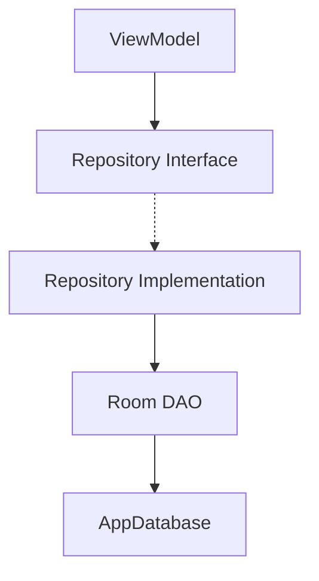

# Design Document - Issue #6: Implement Repository Layer

## Overview
This design implements the repository layer to decouple the domain/UI logic from the Room data source. It introduces repository interfaces in the `domain` layer and their implementations in the `data` layer.

## Steering Document Alignment

### Technical Standards (tech.md)
- **MVVM with Clean Architecture**: Separation into UI, Domain, and Data layers.
- **Dependency Inversion**: Domain logic depends on abstractions (interfaces), not implementations.
- **Kotlin Coroutines/Flow**: Used for asynchronous data access.

### Project Structure (structure.md)
- **Domain Layer**: `com.example.underpressure.domain.repository` for interfaces.
- **Data Layer**: `com.example.underpressure.data.repository` for implementations.

## Code Reuse Analysis
This feature leverages existing Room DAOs and Entities.

### Existing Components to Leverage
- **MeasurementDao** and **AppSettingsDao**: For database operations.
- **MeasurementEntity** and **AppSettingsEntity**: For data representation.

### Integration Points
- **AppDatabase**: Source of DAO instances.
- **ViewModels (Future)**: Will inject repositories for data access.

## Architecture

## Components and Interfaces

### MeasurementRepository (Interface)
- **Purpose:** Contract for measurement data operations.
- **Methods:**
    - `suspend fun saveMeasurement(measurement: MeasurementEntity): Long`
    - `suspend fun updateMeasurement(measurement: MeasurementEntity)`
    - `suspend fun deleteMeasurement(measurement: MeasurementEntity)`
    - `fun getMeasurementsByDate(date: String): Flow<List<MeasurementEntity>>`
    - `fun getAllMeasurements(): Flow<List<MeasurementEntity>>`
    - `fun getMeasurementsByValue(value: Int): Flow<List<MeasurementEntity>>`

### SettingsRepository (Interface)
- **Purpose:** Contract for application settings.
- **Methods:**
    - `suspend fun saveSettings(settings: AppSettingsEntity)`
    - `fun getSettings(): Flow<AppSettingsEntity?>`

### MeasurementRepositoryImpl
- **Purpose:** Room-based implementation of `MeasurementRepository`.
- **Dependencies:** `MeasurementDao`.

### SettingsRepositoryImpl
- **Purpose:** Room-based implementation of `SettingsRepository`.
- **Dependencies:** `AppSettingsDao`.

## Data Models
Reuses existing `MeasurementEntity` and `AppSettingsEntity` from the data layer for simplicity in this phase.

## Error Handling
- **Database Failures**: Repository methods will allow exceptions to propagate or wrap them in a `Result` type (to be decided during implementation).
- **Missing Data**: `getSettings` returns a `Flow` of nullable entity, allowing the UI to handle the "no settings" state.

## Testing Strategy

### Unit Testing
- **Tooling**: Use `MockK` (recommended) or `Mockito` to mock DAOs.
- **Scope**: Verify that repository implementations correctly delegate calls to DAOs and handle return values.

### Integration Testing
- **Tooling**: Use `androidx-room-testing` with an in-memory database to verify the full stack from Repository to SQLite.
