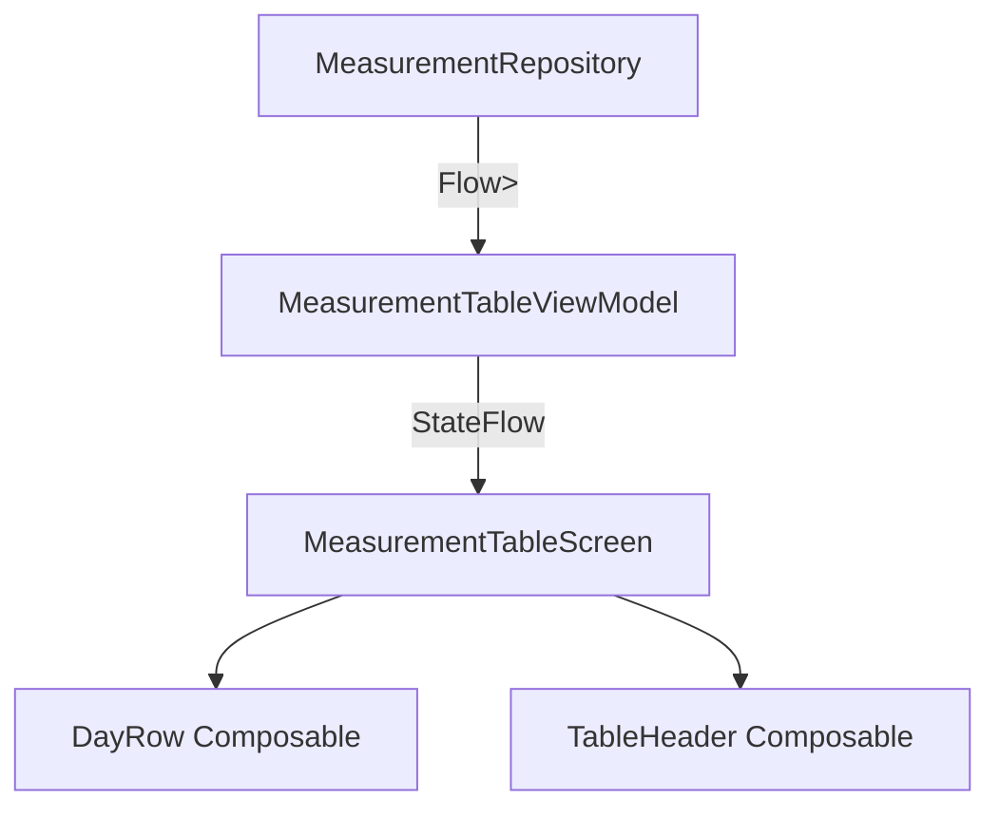

# Design Document - Issue #7: Table UI Layout

## Overview
This design implements a scrollable table view using Jetpack Compose to display daily blood pressure measurements. It focuses on performance, readability, and Material 3 compliance.

## Steering Document Alignment

### Technical Standards (tech.md)
- Uses **Jetpack Compose** with `LazyColumn` for the scrollable list.
- Implements **MVVM** pattern with state managed by a `ViewModel`.
- Leverages **StateFlow** for reactive UI updates.

### Project Structure (structure.md)
- UI components placed in `com.example.underpressure.ui.table`.
- Follows the established Kotlin and Compose naming conventions.

## Architecture

The screen will be driven by a `MeasurementTableViewModel` which aggregates data from the `MeasurementRepository`.



## Components and Interfaces

### MeasurementTableScreen
- **Purpose:** The root Composable for the table view.
- **State:** Observes `TableUiState` from the ViewModel.
- **Dependencies:** `MeasurementTableViewModel`.

### DayRow
- **Purpose:** Renders a single row in the table representing one day.
- **Interfaces:** Accepts `date: String`, `systolic: Int?`, `diastolic: Int?`, `pulse: Int?`, and `isToday: Boolean`.
- **Reuses:** Standard Material 3 `Surface` and `Text` components.

## Data Models

### TableUiState
```kotlin
data class TableUiState(
    val isLoading: Boolean = false,
    val items: List<DayMeasurementSummary> = emptyList(),
    val error: String? = null
)
```

### DayMeasurementSummary
```kotlin
data class DayMeasurementSummary(
    val date: String,
    val systolic: Int? = null,
    val diastolic: Int? = null,
    val pulse: Int? = null,
    val isToday: Boolean = false
)
```

## Testing Strategy

### Unit Testing
- **ViewModel Test**: Verify that data from the repository is correctly mapped and grouped into `DayMeasurementSummary` items.
- **Logic Test**: Ensure "Today" is correctly identified based on the system clock.

### Integration Testing
- **Repository Integration**: Verify that the Flow from `MeasurementRepository` correctly triggers UI state updates.

### UI Testing
- **Compose Test**: Verify that `LazyColumn` renders the correct number of items and the "Today" highlight is present.
