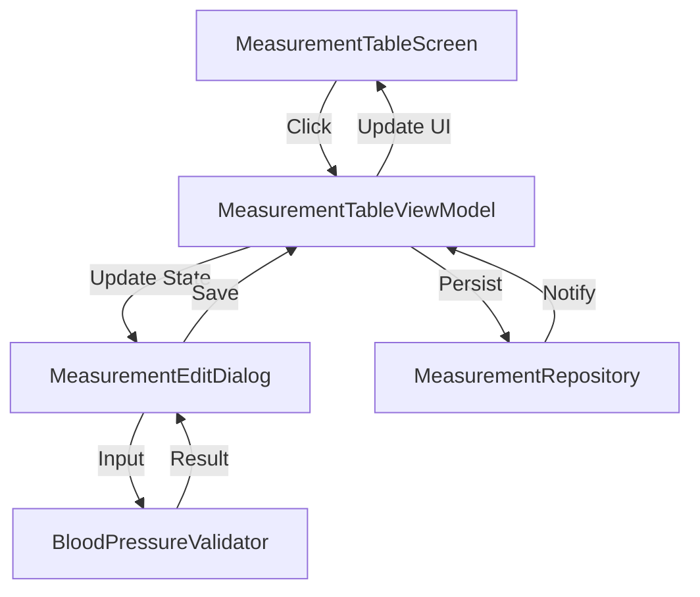

# Design Document - Issue 8: Cell Click + Edit Dialog

## Overview

This feature introduces an interactive Edit Measurement Dialog that appears when a user clicks on a table cell in the main measurement table. It allows for the input and validation of systolic, diastolic, and pulse values in a single string format ("SYS/DIA @PULSE") and handles persistence to the local Room database.

## Steering Document Alignment

### Technical Standards (tech.md)
- **MVVM Pattern**: Uses ViewModel to manage dialog state and business logic.
- **Jetpack Compose**: Implements the dialog using `AlertDialog` and Material 3 components.
- **Reactive UI**: Uses `StateFlow` to ensure the table updates immediately after saving.

### Project Structure (structure.md)
- **UI Layer**: Dialog Composable will be placed in `ui/table/components/MeasurementEditDialog.kt`.
- **Domain Layer**: Validation logic will be placed in `domain/validation/BloodPressureValidator.kt`.
- **Data Layer**: Leverages the existing `MeasurementRepository` for CRUD operations.

## Code Reuse Analysis

### Existing Components to Leverage
- **MeasurementRepository**: Used to `saveMeasurement` and `updateMeasurement`.
- **MeasurementEntity**: Used to map validated input back to the database schema.
- **DayRow/TableCell**: Will be extended to handle click events.

### Integration Points
- **MeasurementTableViewModel**: Will be updated to hold `MeasurementDialogState` and handle save/cancel actions.
- **Room Database**: New measurements will be persisted via the repository, triggering a refresh of the `uiState` Flow.

## Architecture

The design follows Clean Architecture principles by separating validation logic into the domain layer and UI state management into the ViewModel.



### Modular Design Principles
- **Single File Responsibility**: `BloodPressureValidator` only handles string parsing and validation.
- **Component Isolation**: `MeasurementEditDialog` is a stateless Composable (except for internal text field state).
- **Service Layer Separation**: ViewModel orchestrates between the UI and the Repository.

## Components and Interfaces

### BloodPressureValidator (New)
- **Purpose:** Parses and validates the input string format "SYS/DIA @PULSE".
- **Interfaces:** `validate(input: String): ValidationResult`
- **Dependencies:** None

### MeasurementEditDialog (New)
- **Purpose:** Provides a Material 3 dialog for data entry.
- **Interfaces:** `MeasurementEditDialog(state: MeasurementDialogState, onSave: (String) -> Unit, onDismiss: () -> Unit)`
- **Dependencies:** `Material 3`, `Compose UI`

### MeasurementTableViewModel (Updated)
- **Purpose:** Manages the visibility and data context of the dialog.
- **Interfaces:** `onCellClicked(date: String, slotIndex: Int)`, `saveMeasurement(input: String)`, `dismissDialog()`
- **Reuses:** `MeasurementRepository`

## Data Models

### MeasurementDialogState (New)
```kotlin
data class MeasurementDialogState(
    val isOpen: Boolean = false,
    val date: String = "",
    val slotIndex: Int = 0,
    val initialValue: String = "",
    val existingMeasurementId: Long? = null
)
```

## Error Handling

### Error Scenarios
1. **Invalid Format:** User enters "120/80" without pulse or "abc".
   - **Handling:** `BloodPressureValidator` returns `Error` state; Dialog shows red helper text.
   - **User Impact:** "Save" button is disabled; user receives immediate feedback.

2. **Database Save Failure:** Repository fails to write to Room.
   - **Handling:** ViewModel catches exception and updates `TableUiState` with an error message.
   - **User Impact:** Dialog stays open or shows an error snackbar.

## Testing Strategy

### Unit Testing
- **BloodPressureValidatorTest**: Exhaustive tests for various valid/invalid input strings.
- **MeasurementTableViewModelTest**: Verify that `onCellClicked` updates the dialog state correctly and `saveMeasurement` calls the repository.

### Integration Testing
- **RepositoryIntegrationTest**: Ensure `saveMeasurement` and `updateMeasurement` correctly affect the `getAllMeasurements` flow.

### End-to-End Testing (UI Test)
- **MeasurementTableScreenTest**: 
    1. Click cell.
    2. Verify dialog appears.
    3. Type valid data.
    4. Click Save.
    5. Verify dialog closes and table shows new value.
