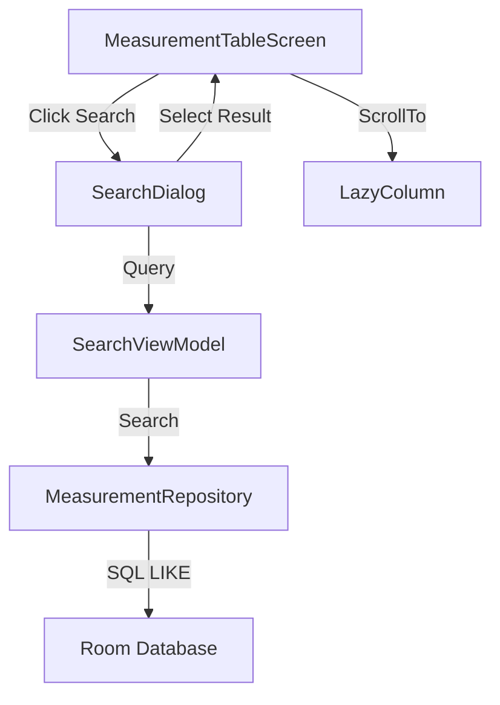

# Design Document: Search and Navigation (Issue #9)

## Overview
This feature introduces a comprehensive search and navigation system for blood pressure measurements. It allows users to jump to specific dates and search for measurements containing specific numeric values (systolic, diastolic, or pulse) through a unified search interface.

## Steering Document Alignment

### Technical Standards (tech.md)
- **MVVM + Clean Architecture**: Implements a new `SearchViewModel` and updates the `MeasurementRepository`.
- **Jetpack Compose**: Uses Material 3 `SearchDialog` and responsive UI patterns.
- **Coroutines & Flow**: Employs asynchronous search queries with `StateFlow` for UI state.
- **Room Persistence**: Extends `MeasurementDao` with optimized SQLite queries.

### Project Structure (structure.md)
- **UI Layer**: New components in `ui.table.components` and `SearchViewModel` in `ui.table`.
- **Data Layer**: Updates to `data.local.dao.MeasurementDao` and `domain.repository.MeasurementRepository`.
- **Naming**: Follows `PascalCase` for Kotlin files and `camelCase` for methods.

## Code Reuse Analysis

### Existing Components to Leverage
- **`MeasurementEntity`**: Reused as the primary data model for search results.
- **`MeasurementRepository`**: Extended to include search-specific data fetching.
- **`BloodPressureValidator`**: Reused (or extended) for date and numeric input validation.
- **`MeasurementTableViewModel`**: Integrated to receive navigation events (scrolling to a specific date).

### Integration Points
- **TopAppBar**: Integration point for the search entry button.
- **Room Database**: New SQL queries for partial numeric matches.
- **LazyListState**: Used to coordinate scrolling in the main table view.

## Architecture
The search feature is implemented as a semi-independent module that interacts with the existing measurement table via a shared repository and navigation events.

### Modular Design Principles
- **Single File Responsibility**: `SearchDialog.kt` handles only the UI, while `SearchViewModel.kt` handles search logic.
- **Component Isolation**: The search dialog is a standalone Material 3 component.
- **Service Layer Separation**: Search logic is encapsulated in the repository/DAO layer.



## Components and Interfaces

### `SearchDialog`
- **Purpose:** Provide a modal interface for entering search queries and displaying results.
- **Interfaces:** `onDismiss()`, `onResultClick(date: String)`
- **Dependencies:** `SearchViewModel`
- **Reuses:** Material 3 `AlertDialog`, `TextField`, and `LazyColumn`.

### `SearchViewModel`
- **Purpose:** Manage search query state, trigger database searches, and handle date validation.
- **Interfaces:** `updateQuery(query: String)`, `searchResults: StateFlow<SearchUiState>`
- **Dependencies:** `MeasurementRepository`

### `MeasurementDao` (Update)
- **Purpose:** Provide low-level database access for partial matches.
- **Interfaces:** `searchByValue(query: String): Flow<List<MeasurementEntity>>`

## Data Models

### `SearchUiState`
```kotlin
data class SearchUiState(
    val query: String = "",
    val results: List<MeasurementEntity> = emptyList(),
    val isLoading: Boolean = false,
    val dateError: String? = null,
    val isNoResults: Boolean = false
)
```

## Error Handling

### Error Scenarios
1. **Invalid Date Format:** User enters a malformed date (e.g., "202-03-01").
   - **Handling:** Validate input using `DateTimeFormatter`; set `dateError` in UI state.
   - **User Impact:** Inline error message in the search field.

2. **No Results Found:** Query returns an empty list.
   - **Handling:** Check result list size in ViewModel; set `isNoResults` flag.
   - **User Impact:** "No results found" placeholder in the dialog.

## Testing Strategy

### Unit Testing
- **Search Logic**: Test `SearchViewModel` for query debouncing and date parsing.
- **Validation**: Test input validation for both dates and numeric values.

### Integration Testing
- **DAO Queries**: Test `searchByValue` in `MeasurementDao` with various partial match scenarios (e.g., searching "120" matches systolic 120, diastolic 120, or pulse 120).
- **Repository**: Verify `MeasurementRepository` correctly orchestrates search results.

### End-to-End Testing
- **Search Flow**: Open dialog -> Enter query -> Click result -> Verify main table scrolls to the correct date.
